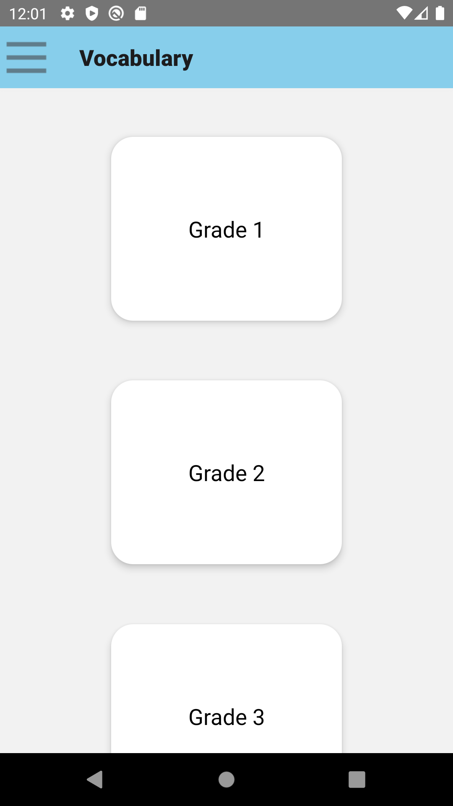
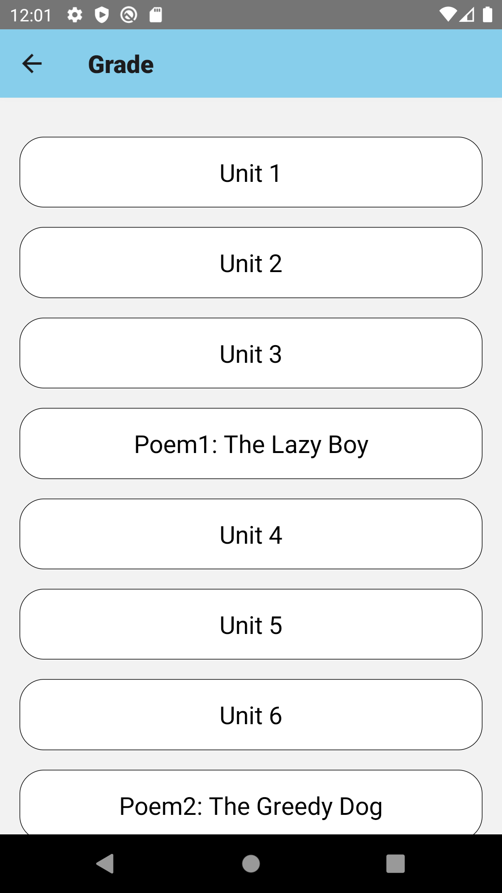
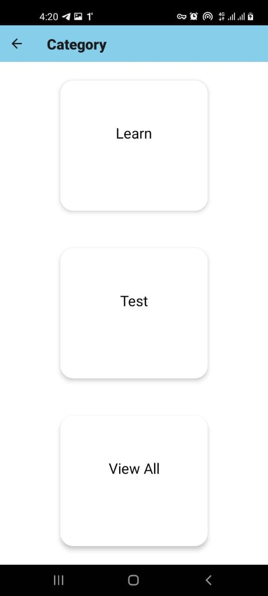
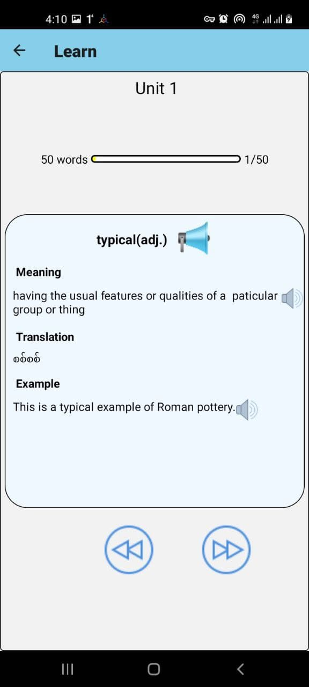
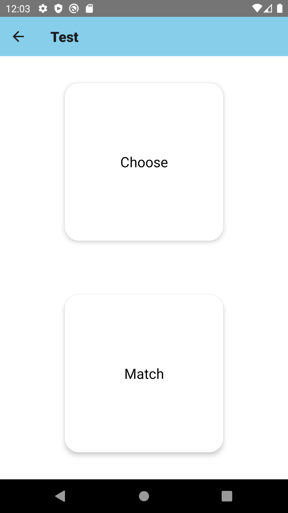
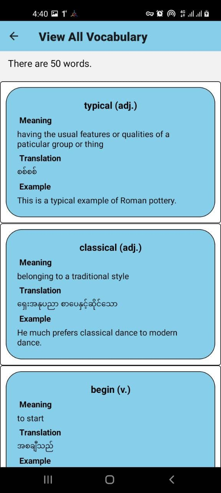

# Vocabulary

- It intends to study vocabulary for garde1-11 students.
- It includes mainly two features (Learn and Test).
- Learning section contains details of each word unit by unit.
- Testing section includes two exercises (Choose and Match).
- It is developed with React Native.

  | Main Page                               | Unit Page                               | Category Page                                  | Learn Page                                | Test Page                               | View All Page                           |
  | --------------------------------------- | --------------------------------------- | ---------------------------------------------- | ----------------------------------------- | --------------------------------------- | --------------------------------------- |
  |  |  |  |  |  |  |
